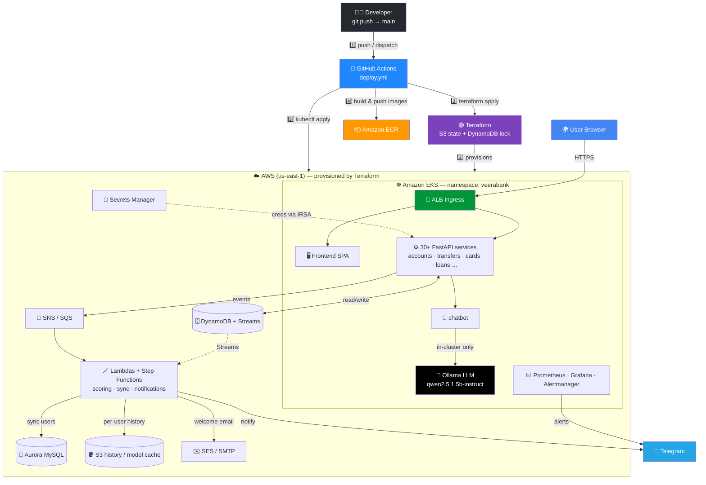
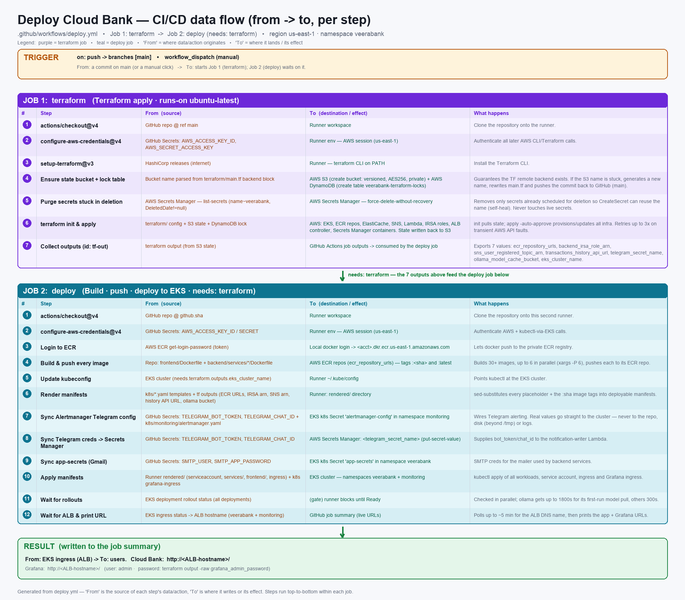
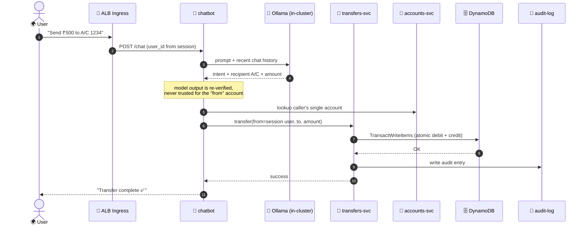
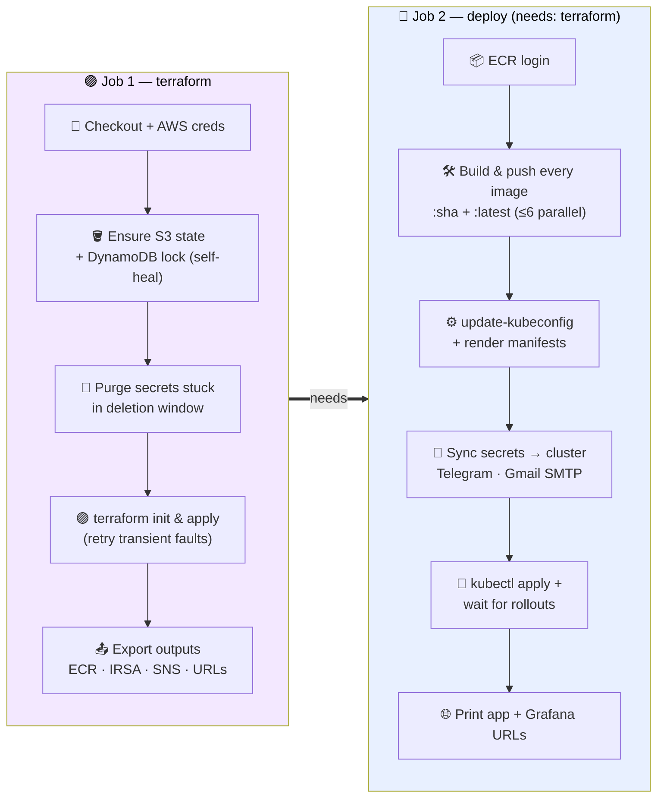

<div align="center">

# 🏦 Cloud Bank — LLM-Powered Microservice Banking Platform

### 30+ **FastAPI** microservices · event-driven **Lambdas** · a self-hosted **LLM chatbot** — provisioned by **Terraform** and shipped to **AWS EKS** by a single **GitHub Actions** pipeline

<p>


</p>
<p>


</p>
<p>


</p>

<p>


</p>

</div>

> ⚠️ **This is a demo / reference architecture, not a production banking system.** Ensure TLS, real authn/authz, and compliance controls before any real use.
>
> Region: `us-east-1` · Kubernetes namespace: `veerabank` · Monitoring namespace: `monitoring`

---

## 📑 Table of Contents

| # | Section | # | Section |
|:-:|:--|:-:|:--|
| 1 | [🎯 Overview](#-overview) | 6 | [🔁 CI/CD Pipeline](#-cicd-pipeline) |
| 2 | [🏗 Architecture](#-architecture) | 7 | [🚀 Deploy](#-deploy) |
| 3 | [🌍 Request & Data Flow](#-request--data-flow) | 8 | [🔐 Required GitHub Secrets](#-required-github-secrets) |
| 4 | [🧩 Microservices](#-microservices) | 9 | [📈 Monitoring & Alerting](#-monitoring--alerting) |
| 5 | [🧰 Tech Stack](#-tech-stack) | 10 | [📁 Repository Structure](#-repository-structure) · [🔒 Security](#-security-notes) |

---

## 🎯 Overview

A cloud-native banking application that runs on **AWS EKS** and is provisioned + shipped end-to-end by a single **GitHub Actions** pipeline (Terraform → build → deploy). It bundles **30+ backend microservices** (FastAPI), **five event-driven Lambdas**, a **Step Functions** credit/fraud scoring pipeline, a single-page frontend, and a full observability stack (**Prometheus · Grafana · Alertmanager**) with **Telegram** alerting.

The support **chatbot is powered by a self-hosted Ollama LLM** (`qwen2.5:1.5b-instruct`) running entirely inside the cluster — no third-party API, no per-message cost, no data leaving the VPC.

| 🧩 Domain | 📦 What runs |
|:--|:--|
| ⚙️ Backend | 30+ FastAPI microservices, one Docker image each |
| 🪄 Serverless | 5 Lambdas + a Step Functions scoring state machine |
| 🤖 AI | In-cluster Ollama LLM behind the `chatbot` service |
| 🗄 Data | DynamoDB (+ Streams), Aurora MySQL, S3, ElastiCache |
| 📨 Messaging | SNS / SQS, SES / Gmail SMTP |
| 📊 Observability | Prometheus, Grafana, Alertmanager → Telegram |
| 🖥 Frontend | Vanilla HTML/CSS/JS SPA (per-service themed UIs) |

---

## 🏗 Architecture

> Arrows show the **direction of provisioning, traffic, and events** — from a developer push, through the pipeline, into the cluster, and out to managed AWS services.



The original detailed diagrams are also included as images:

| Architecture | CI/CD workflow | CI/CD (detailed data flow) |
|:--:|:--:|:--:|
|  |  |  |

---

## 🌍 Request & Data Flow

How a user action (e.g. a money transfer, or a chatbot-initiated transfer) travels through the system:



> 🔒 Security detail worth calling out: the **`from` account is always taken from the logged-in session**, never from chatbot text — and every transfer is an atomic DynamoDB `TransactWriteItems`, so concurrent requests can't double-spend.

---

## 🧩 Microservices

Each is an independent FastAPI app + Docker image, deployed as its own Deployment/Service in `k8s/services/`.

<div align="center">

| 💳 Core banking | 💰 Money movement | 🛡 Risk & compliance | 🧑‍💼 Ops & extras |
|:--|:--|:--|:--|
| `accounts` | `transfers` | `kyc` | `admin` |
| `transactions` | `payments` | `fraud-detection` | `admin-analytics` |
| `users` | `bill-payments` | `disputes` | `reports` |
| `cards` | `recurring-payments` | `audit-log` | `budgeting` |
| `virtual-cards` | `beneficiaries` | `support-tickets` | `goals` |
| `loans` | `statements` | `webhooks` | `rewards` |
| `fixed-deposits` | `cheques` | `notifications` | `forex` · `insurance` · `lockers` |

</div>

Plus **`chatbot`** — the LLM support assistant backed by the in-cluster **Ollama** model.

Shared plumbing lives in `backend/common/` (`aws_clients.py`, `service_base.py`, `mailer.py`). Per-user services (cards, loans, kyc, …) reuse `make_user_scoped_router()` for their list/get/delete routes against a `user_id-index` DynamoDB GSI, while each still defines its own typed Pydantic models and domain endpoints.

### 🪄 Lambdas & scoring

| Lambda / component | Trigger | Purpose |
|:--|:--|:--|
| `transactions_history` | API | Per-user transaction history from S3 |
| `notification_writer` | SQS | Writes notifications to DynamoDB + welcome email (SES/SMTP) |
| `users_db_sync` | DynamoDB Streams | Syncs the users table into Aurora MySQL |
| `credit_score` | Step Functions | Credit scoring step |
| `fraud_score` | Step Functions | Fraud scoring step |

A **Step Functions** state machine (`terraform/modules/scoring`) orchestrates the credit/fraud scoring shown on the frontend's Scores page.

---

## 🧰 Tech Stack

| Layer | Technology |
|:--|:--|
| 🧭 Orchestration | AWS EKS (Kubernetes) · ALB Ingress Controller |
| 🟣 IaC | Terraform (19 modules · S3 remote state + DynamoDB lock) |
| 🔄 CI/CD | GitHub Actions (2-job pipeline) |
| 📦 Containers | Docker · Amazon ECR |
| ⚙️ Services | Python · FastAPI · Uvicorn · Pydantic · boto3 |
| 🗄 Data | DynamoDB (+ Streams) · Aurora MySQL · S3 · ElastiCache |
| 📨 Messaging / Email | SNS · SQS · SES / Gmail SMTP |
| 🪄 Serverless | AWS Lambda · Step Functions |
| 🔐 Secrets / IAM | AWS Secrets Manager · Kubernetes Secrets · **IRSA** (no static keys in-cluster) |
| 🤖 AI | Self-hosted **Ollama** LLM (`qwen2.5:1.5b-instruct`) |
| 📊 Observability | Prometheus · Grafana · Alertmanager → Telegram |
| 🖥 Frontend | Vanilla HTML / CSS / JS SPA (per-service themes) |

---

## 🔁 CI/CD Pipeline

Everything is driven by [`.github/workflows/deploy.yml`](.github/workflows/deploy.yml), on push to `main` or manual `workflow_dispatch`.



**Job 1 — `terraform`**: checkout → ensure state bucket + lock table (idempotent) → purge stuck Secrets Manager secrets → `terraform apply -auto-approve` → export outputs (ECR URLs, IRSA role ARN, SNS topic, history API URL, Telegram secret name, Ollama cache bucket, EKS cluster name).

**Job 2 — `deploy`** (`needs: terraform`): ECR login → build & push every image (`:sha` + `:latest`, up to 6 in parallel) → `update-kubeconfig` + render manifests → sync Telegram/Gmail secrets into the cluster → `kubectl apply`, wait for rollouts, print live app + Grafana URLs.

A per-step **from → to** breakdown is in [`docs/cicd-workflow-detailed.png`](docs/cicd-workflow-detailed.png).

---

## 🚀 Deploy

### ✅ Automated (recommended)

1. Add the [GitHub secrets](#-required-github-secrets).
2. Push to `main`, **or** trigger manually:
   ```bash
   gh workflow run deploy.yml --ref main
   ```
3. The app and Grafana URLs are printed in the run summary. The state bucket + lock table are created automatically on first run — no manual bootstrap needed for CI.

### 🔧 Manual (Terraform by hand)

```bash
# one-time remote-state bootstrap (only outside CI)
./scripts/bootstrap-state.sh

cd terraform
terraform init
terraform apply
```

Then build/push images to the ECR repos from `terraform output ecr_repository_urls`, substitute them into `k8s/` manifests, and `kubectl apply` (see the `deploy` job in `deploy.yml` for the exact rendering steps).

---

## 🔐 Required GitHub Secrets

Set these in **Settings → Secrets and variables → Actions**:

| 🔑 Secret | 🎯 Purpose |
|:--|:--|
| `AWS_ACCESS_KEY_ID` | Terraform + deploy AWS access |
| `AWS_SECRET_ACCESS_KEY` | Terraform + deploy AWS access |
| `SMTP_USER` | Gmail SMTP user (transactional email) |
| `SMTP_APP_PASSWORD` | Gmail SMTP app password |
| `TELEGRAM_BOT_TOKEN` | Telegram notifications + alerts |
| `TELEGRAM_CHAT_ID` | Telegram chat to notify |

> Secret values are read directly from GitHub Actions into the cluster / Secrets Manager at deploy time — never written to the repo, to disk (beyond `/tmp`), or to logs.

---

## 📈 Monitoring & Alerting

- **Prometheus** scrapes the cluster; **Grafana** is exposed via its own ingress — admin password: `terraform output -raw grafana_admin_password`.
- **Alertmanager** routes alerts to **Telegram** using the synced `alertmanager-config` secret.

---

## 📁 Repository Structure

```text
.
├── terraform/                 # 19 modules: vpc, eks, ecr, dynamodb, rds (Aurora),
│                              #   s3, sns, sqs/messaging, ses, lambda, scoring,
│                              #   monitoring, observability, security, ai, ...
├── backend/
│   ├── common/                # aws_clients.py · service_base.py · mailer.py
│   ├── lambdas/               # transactions_history · notification_writer ·
│   │                          #   users_db_sync · credit_score · fraud_score
│   └── services/              # 30+ FastAPI microservices (one image each)
├── frontend/                  # Single-page HTML/CSS/JS dashboard (per-service themes)
├── k8s/
│   ├── services/              # Deployment + Service per microservice (+ Ollama)
│   ├── frontend/              # Frontend Deployment + Service
│   ├── monitoring/            # Prometheus / Grafana / Alertmanager
│   ├── ingress.yaml           # ALB ingress
│   ├── serviceaccount.yaml    # IRSA-annotated service account
│   └── app-secrets.example.yaml
├── scripts/                   # bootstrap-state.sh (manual TF state bootstrap)
├── docs/                      # architecture & CI/CD diagrams (PNG)
└── .github/workflows/deploy.yml
```

---

## 🔒 Security Notes

- 🌐 Exposed via an **ALB ingress** — configure **TLS/auth** before any real use; this is a demo/reference, **not** a production banking system.
- 🔑 Pod IAM uses **IRSA** — no static AWS keys inside the cluster.
- 🧠 The chatbot's LLM is **in-cluster only** (Ollama); no prompt or account data leaves the VPC, and the model is never trusted to choose the debit account.
- 🙈 Never commit real secrets — use the GitHub secrets flow above; `k8s/app-secrets.example.yaml` is a template only.

---

## 📄 License

See [`LICENSE`](LICENSE) if present; otherwise treat as all-rights-reserved by the repository owner.

---

<div align="center">

### ⭐ Terraform · EKS · FastAPI · Lambda · Ollama — one push, fully deployed


**[⬆ Back to top](#-cloud-bank--llm-powered-microservice-banking-platform)**

</div>
