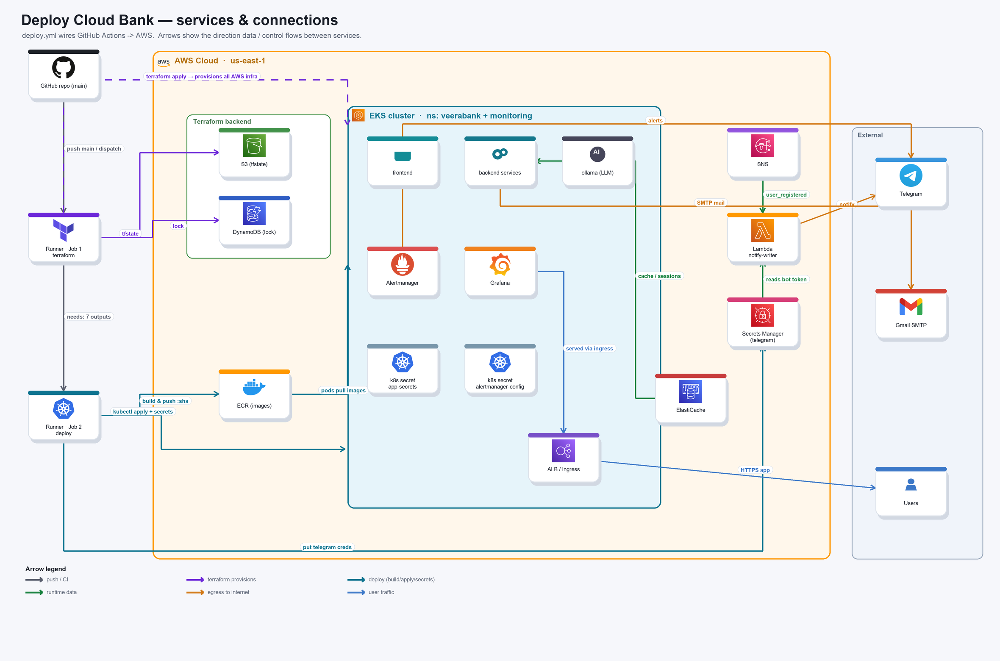
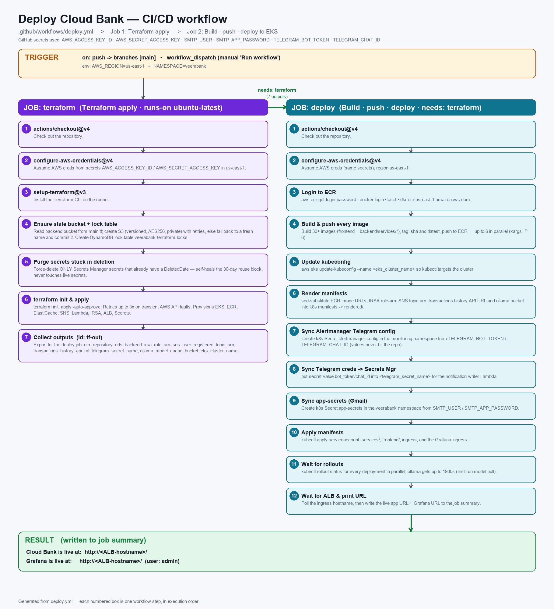

# Cloud Bank

A cloud‑native, microservice banking application that runs on **AWS EKS** and is
provisioned and shipped end‑to‑end by a single **GitHub Actions** pipeline
(Terraform → build → deploy). It bundles 30+ backend microservices, three
event‑driven Lambdas, a single‑page frontend, and a full monitoring stack
(Prometheus · Grafana · Alertmanager) with Telegram alerting.

> Region: `us-east-1` · Kubernetes namespace: `veerabank` · Monitoring namespace: `monitoring`

---

## 🏗️ Architecture



- **GitHub Actions** provisions infrastructure with **Terraform** (remote state in
  **S3**, locking in **DynamoDB**), then builds every image and deploys to **EKS**.
- **EKS** runs the frontend, all backend microservices, the self‑hosted **Ollama**
  LLM (used by the chatbot), and the monitoring stack, fronted by an **ALB / Ingress**.
- **Managed services**: **ECR** (images), **DynamoDB** (+ Streams), **Aurora MySQL**
  (read replica of the users table), **S3** (per‑user history), **SNS/SQS**,
  **SES/SMTP** (email), **ElastiCache** (cache/sessions), **Lambda** (event handlers),
  and **Secrets Manager** (Telegram credentials).
- **External**: users reach the app over the ALB; the notification Lambda and
  Alertmanager push to **Telegram**; transactional email is sent via **Gmail SMTP**.

---

## 🚀 CI/CD pipeline

Everything is driven by [`.github/workflows/deploy.yml`](.github/workflows/deploy.yml),
which runs on push to `main` or via manual **Run workflow** (`workflow_dispatch`).



**Job 1 — `terraform`**
1. Checkout · configure AWS credentials · install Terraform.
2. Ensure the S3 state bucket + DynamoDB lock table exist (self‑healing, idempotent).
3. Purge any Secrets Manager secrets stuck in a deletion window.
4. `terraform init && terraform apply -auto-approve` (retries transient AWS faults).
5. Export outputs (ECR URLs, IRSA role ARN, SNS topic ARN, history API URL,
   Telegram secret name, Ollama model‑cache bucket, EKS cluster name).

**Job 2 — `deploy`** (`needs: terraform`)
1. Login to ECR and **build & push every image** (`:sha` and `:latest`, up to 6 in parallel).
2. `aws eks update-kubeconfig`, then render manifests (substitute image URLs + Terraform outputs).
3. Sync secrets straight from GitHub Actions into the cluster / Secrets Manager
   (Alertmanager Telegram config, Telegram creds, Gmail SMTP `app-secrets`).
4. `kubectl apply` everything, wait for rollouts, then print the live app + Grafana URLs.

A per‑step **from → to** data‑flow breakdown is in
[`docs/cicd-workflow-detailed.png`](docs/cicd-workflow-detailed.png).

---

## 📁 Repository structure

```text
.
├── terraform/                 # VPC, EKS, ECR, DynamoDB, Aurora, S3, SNS/SQS, SES, Lambda, IAM/IRSA
├── backend/
│   ├── common/                # Shared DynamoDB, SNS, S3 and SMTP helpers
│   ├── lambdas/
│   │   ├── transactions_history/   # per-user S3 history API
│   │   ├── notification_writer/    # SQS → DynamoDB + welcome email (SES/SMTP)
│   │   └── users_db_sync/          # DynamoDB Streams → Aurora MySQL
│   └── services/              # 30+ FastAPI-style microservices (one image each)
├── frontend/                  # Single-page HTML/CSS/JS banking dashboard
├── k8s/
│   ├── services/              # Deployment + Service manifest per microservice
│   ├── frontend/              # Frontend Deployment + Service
│   ├── monitoring/            # Prometheus / Grafana / Alertmanager
│   ├── ingress.yaml           # ALB ingress
│   ├── namespace.yaml
│   ├── serviceaccount.yaml    # IRSA-annotated service account
│   └── app-secrets.example.yaml
├── scripts/                   # bootstrap-state.sh (manual TF state bootstrap)
├── docs/                      # architecture & CI/CD diagrams
└── .github/workflows/deploy.yml
```

### Microservices

`accounts` · `transactions` · `transfers` · `users` · `cards` · `virtual-cards` ·
`loans` · `payments` · `bill-payments` · `recurring-payments` · `beneficiaries` ·
`statements` · `notifications` · `kyc` · `fixed-deposits` · `cheques` · `disputes` ·
`audit-log` · `fraud-detection` · `support-tickets` · `rewards` · `admin` ·
`admin-analytics` · `reports` · `budgeting` · `goals` · `lockers` · `forex` ·
`insurance` · `webhooks` · `chatbot` (backed by the in‑cluster **Ollama** LLM).

---

## 🧰 Tech stack

| Layer            | Technology |
|------------------|------------|
| Orchestration    | AWS EKS (Kubernetes), ALB Ingress Controller |
| IaC              | Terraform (S3 remote state + DynamoDB lock) |
| CI/CD            | GitHub Actions |
| Containers       | Docker, Amazon ECR |
| Data             | DynamoDB (+ Streams), Aurora MySQL, S3, ElastiCache |
| Messaging/Email  | SNS, SQS, SES / Gmail SMTP |
| Serverless       | AWS Lambda |
| Secrets          | AWS Secrets Manager, Kubernetes Secrets |
| AI               | Self‑hosted Ollama (LLM) for the chatbot |
| Observability    | Prometheus, Grafana, Alertmanager → Telegram |
| Frontend         | Vanilla HTML / CSS / JS SPA |

---

## 🔐 Required GitHub secrets

Set these in **Settings → Secrets and variables → Actions**:

| Secret | Purpose |
|--------|---------|
| `AWS_ACCESS_KEY_ID` | Terraform + deploy AWS access |
| `AWS_SECRET_ACCESS_KEY` | Terraform + deploy AWS access |
| `SMTP_USER` | Gmail SMTP user (transactional email) |
| `SMTP_APP_PASSWORD` | Gmail SMTP app password |
| `TELEGRAM_BOT_TOKEN` | Telegram notifications + alerts |
| `TELEGRAM_CHAT_ID` | Telegram chat to notify |

> Secret values are read directly from GitHub Actions into the cluster / Secrets
> Manager at deploy time — they are never written to the repo, to disk (beyond
> `/tmp`), or to logs.

---

## ▶️ Deploy

### Automated (recommended)

1. Add the GitHub secrets above.
2. Push to `main` **or** trigger the workflow manually:
   ```bash
   gh workflow run deploy.yml --ref main
   ```
3. When it finishes, the app and Grafana URLs are printed in the run summary.

The state bucket and lock table are created automatically on the first run — no
manual bootstrap is required for CI.

### Manual (running Terraform by hand)

```bash
# one-time remote-state bootstrap (only needed outside CI)
./scripts/bootstrap-state.sh

cd terraform
terraform init
terraform apply
```

Then build/push images to the ECR repos from `terraform output ecr_repository_urls`,
substitute them into `k8s/` manifests, and `kubectl apply` (see `deploy.yml`'s
`deploy` job for the exact rendering/substitution steps).

---

## 📈 Monitoring & alerting

- **Prometheus** scrapes the cluster; **Grafana** is exposed via its own ingress
  (admin password: `terraform output -raw grafana_admin_password`).
- **Alertmanager** routes alerts to **Telegram** using the synced
  `alertmanager-config` secret.

---

## 🖥️ Frontend

A single‑page dashboard (`frontend/src`) covering accounts, transfers, cards
(debit / credit / virtual), payments, statements, and every other service, plus a
chatbot backed by the in‑cluster Ollama model.

---

## 🔒 Security notes

- App is exposed via an ALB ingress — ensure TLS/auth are configured before any
  real use; this project is a demo/reference and **not** a production banking system.
- IAM access for pods uses **IRSA** (no static keys in the cluster).
- Do not commit real secrets; use the GitHub secrets flow above.

---

## 📄 License

See [`LICENSE`](LICENSE) if present; otherwise treat as all‑rights‑reserved by the
repository owner.
